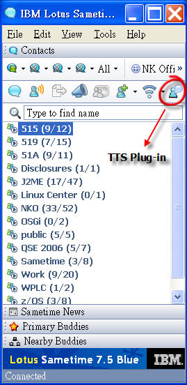
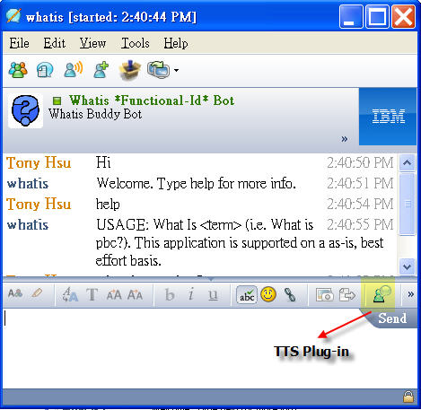
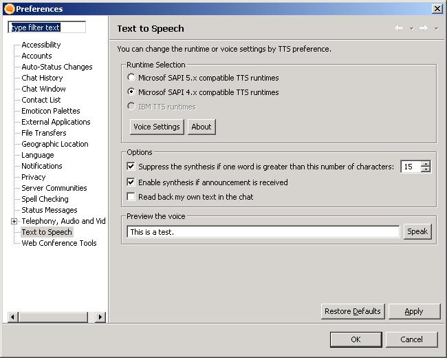

Text-To-Speech plugin for Lotus Sametime
====

Do you need a "Chat Reader" plugin for Sametime 7.5 (and above)? Try this!!

About
----
The idea is to leverage what end users have in their computers rather then install an awful voice package. For example, if user has installed Microsoft Office XP, the TTS plug-in will use Microsoft Speech API. We came out a new architecture which can support multiple speech engines listed below within a tiny package (less than 100KB totally).

Currently supported TTS runtimes:
- Microsoft Speech API (SAPI for short) 5.x, but SAPI 5.3 on Windows Vista is not tested
- Microsoft SAPI 4.x
- IBM TTS v6.x (as known as IBM ECI 6.x)

Compatibility List
----
- Lotus Notes 8.5 with embedded Sametime 8.*
- Lotus Sametime 8.0.2
- Lotus Notes 8.0 with embedded Sametime 7.5.1*
- Lotus Sametime 7.5.1
- Lotus Sametime 7.5
- Lotus Sametime 7.5 beta4

Note: Add the following line in 
** [Notes_folder] \framework\rcp\plugin_customization.ini **
to enable the installation menu: File > Applications > Install

    com.ibm.notes.branding/enable.update.ui=true

Pre-Requisites
----
TTS runtimes need to be installed on your machine. You can get it from one of the following...

- Windows

1. Microsoft Windows XP operating system with SAPI 5
2. Microsoft Office XP suite (and above) with SAPI 5.0
3. Any edition of IBM ViaVoice Release 10.5 (Recommended)
4. NotesBuddy with IBM Voice Synthesizer (Recommended)
5. IBM TTS runtimes v6.x with formant or concatenative voices (Recommended)
6. Any other Microsoft SAPI 5.x or 4.x compatible TTS runtimes

- Linux (TODO)

1. Open Client for Linux 

- Mac OS X (TODO)

1. IBM TTS for Mac OS X

Configuration
----
- To change synthesizer voice settings, go to Sametime "preference" page, and choose "Text to Speech". You will see all available TTS runtimes on your machine.
- To configure SAPI 5.x voice, please use the configuration tool through Speech Properties in Control Panel. (e.g. gender, sample rate... and so on.)

Installation
----
To install this plugin:

1. Install any supported TTS runtimes if you don't have it.
2. Install plugin from Sametime menubar: Tools, Plug-ins, Install Plug-ins.
3. Choose "Search for new features to install" and click "Next".
4. Click "Add Remote Site" and use the name "TTS for Sametime" and the [url]
5. Check "TTS for Sametime" option and click "Finish".
6. Select all, and click "Next".
7. Read and accept the terms of the license agreement. Click "Next".
8. Confirm you are installing "TTS for Sametime" and click "Install".
9. Restart Sametime, if you can see the TTS icon on the Sametime Contact List, it means that TTS plugin is ready to go. Enjoy it!

Screenshots
----
TTS synthesis icon

Turn off current synthesis

Preference Page

Check for updates
----
Follow these instructions if you have already installed the plug-in:

1. From within Sametime, click Tools > Plug-ins > Install Plug-ins.
2. Select Search for updates of the currently installed features.
If a new version if available, you will be presented with a dialog to install it.
Uninstallation

To remove this plugin

- Uninstall plugin from Sametime systray: Manage Updates, Configure.
Expand the tree in the left pane, find "TTS plugin for Sametime", Right click it and select "Uninstall".

Changes History
----
- v1.1.6 (Nov. 2009): Add an option to suppress the synthesis if one word is too long. Fix the core dump issue with inproper settings in preference page.
- v1.1.5 : Add configuration file. Add French resource file, thanks for [Jean-Francois Lagarde] help.
- v1.1.4 : DBCS environments are supported. Added a configuration panel for IBM TTS and SAPI 4.x.
- v1.1.2 : Icon updated, minor bug fixed
- v1.1.1 : Fixed compatible issues for Sametime 7.5.1
- v1.1.0 : Added SAPI 4.x and 5.x support
- v1.0.1 (Nov. 2006): Auto-configuration for IBM TTS runtimes
- v1.0.0 (Oct. 2006): Initial build

Troubleshooting
----
- If there is anything wrong (e.g. VM crash...etc.) for the plugin, please try to delete the preference settings. To clean the settings, just delete the file ** com.ibm.collaboration.realtime.tts.prefs ** on C:\Documents and Settings\ [Your name]\IBM\RCP\Sametime\.metadata\.plugins\org.eclipse.core.runtime\.settings directory.
- If you encounter any problem for TTS plug-in, such as Sametime crash, try to change the values of SAPI4 and IBM ECI to false in options.ini to disable specific TTS runtimes.
- Email your problem to me and I will try to investigate the problem if possible...

Technical Notes
----
- IBM offers at least 10 lanuages of TTS runtimes on Windows, MacOS, Pocket PC, Linux and AIX platforms. This plugin is essentially able to port to these environments. However, license issues need be resolved, or I can not put them together.
- IBM TTS runtimes for Windows 6.x support both Microsoft SAPI 4 and IBM ECI interfaces
- If you have any comments or suggestions, please feel free to contact with me

License
----

MIT

 [Jean-Francois Lagarde]:mailto:jean-francois_lagarde@fr.ibm.com
 [url]:https://github.com/rokaku/tts4st/bin
 